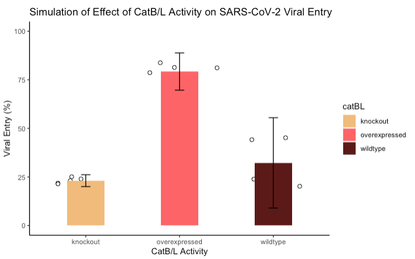
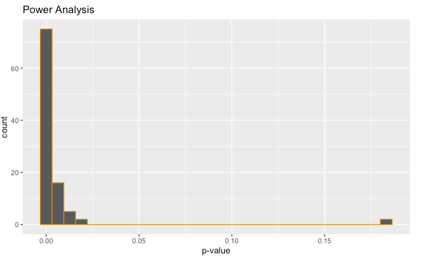

Thank you for reading my Capstone project for the IBS 538 spring semester! Be prepared for some interesting (and current) science in conjuction with statistical ninja skills. This project is not just a culmination of everything I've learned from TJ Murphy but will become a valuable resource for my future research.

```markdown
# Some packages we'll need for data munging, plotting, and statistical tests
library(tidyverse)
library(dplyr)
library(ggplot2)
library(wesanderson)
library(ez)
```
## 1. Background

My research lab focuses on proteases, enzymes that can cleave peptide bonds and break down other proteins. They're small yet play destructive roles in diseases such as sickle cell disease, cardiovascular disease, and various forms of cancer. Recently, they've been implicated in playing a role in SARS-CoV viral entry, the precursor to the novel coronavirus SARS-CoV-2 (known to cause COVID-19). In a recent 2020 study, Hoffman et al. concluded that cysteine proteases cathepsins B and L (CatB/L), in addition to TMPRSS2, are responsible for priming the S protein on SARS-CoV-2 for viral entry into host cells [1]. 

## 2. What's the Unknown?
However, it is unknown why individuals with preexisting conditions have a higher susceptability to SARS-CoV-2. The upregulated levels of active cathepsins present in several diseased states may explain why this occurs.

## 3. Predictions
**If CatB/L activity is upregulated in human lung epithelial cells, then SARS-CoV-2 viral entry should increase.**

## 4. Variables
The dependent variable in this situation will be the amount of viral entry, which is measured. The predictor variable will be the level of cathepsin activity (ordered), represented by 3 different  conditions: cells will either be CatB/L knockout, wildtype (control), or have overexpressed CatB/L activity.

## 5. Hypothesis
For this experiment, I will be testing the null statistical hypothesis that the group mean of viral entry associated with overexpressed CatB/L activity will be the same as that of the control group. The alternate hypothesis is that the group mean associated with overexpressed CatB/L activity will differ compared to that of the control group.

## 6. Statistical Test
With 3 levels of the predictor variable, CatB/L activity, an analysis of variance (ANOVA) is most appropriate. It's obvious that the dependent variable, viral entry, is continuous and measured, and that the predictor variable is discrete and ordered. A one-way completely randomized (CR) ANOVA is the best method to test the hypothesis I've stated above because there is only one factor.

It's also worth noting that, in order to test the group means, post hoc analysis will have to be performed in the form of a pairwise t-test with a Bonferroni p-value adjustment method to control type 1 error.

Because there's 3 explanatory groups, regression is one possible alternative to performing ANOVA. However, the major determinant was that the predictor variable is discrete and ordered. Regression models are ideal when the predictor variables are continuous and measured.

## 7. Experimental Design
There will be 15 different passages (or re-establishing the cell line) of human lung epithelial cells, each independent of each other. Each one will be randomly assigned to one of three groups: wildtype (control), CatB/L knockout, or overexpressed CatB/L. The outcome variable, viral entry, will be measured as a percentage representing how much out of total virus has invaded the host cell. 

The type 1 error threshold is predetermined to be 5%. The previously stated null hypothesis can be safely rejected if the pairwise t-test yields a p-value of less than 0.05 when comparing overexpressed CatB/L to wildtype.

## 8. Plotting Data
The function below, *simulate*, will create random-generated data. This data is then plotted with error bars. The only function argument required is the number of replicates (n) for each group. The expected response should show a significantly higher percent of viral entry for cells overexpressing CatB/L compared to that of wildtype and knockout.

```markdown
# initializers
n <- 5     # number of independent replicates per group
b <- 40    # basal outcome of wildtype
a <- 0.5   # fold-to-basal effect of knockout
f <- 2     # fold-to-basal effect of overexpressed
sd <- 5    # expected standard deviation of outcome variable

# defining dataMaker function
simulate <- function(n, b, a, f, sd) {
  wt <- rnorm(n, b, sd*f)     # wildtype
  ko <- rnorm(n, b*a, sd)   # knock-out CatB/L
  oe <- rnorm(n, b*f, sd)   # overexpressed CatB/L
  
  data <- data.frame(wildtype = wt,
                     knockout = ko,
                     overexpressed = oe) %>%
    pivot_longer(cols = wildtype:overexpressed,
                 names_to = "catBL",
                 values_to = "viral_entry")
  
  data$catBL <- as.factor(data$catBL)
  mutate(data, id = as.factor(1:(3*n)))
}

# simulate random-generated data
data <- simulate(n, b, a, f, sd)

# plotting simulated data
ggplot(data, aes(x = catBL, y = viral_entry)) +
  geom_jitter(shape=21,
              size = 2,
              fill = "white") +
  stat_summary(aes(y = viral_entry, fill = catBL),
             fun = "mean",
             geom = "bar",
             width = 0.4) +
  stat_summary(fun.data = mean_sdl,
             geom = "errorbar",
             width = 0.1) +
  scale_fill_manual(values=wes_palette("GrandBudapest1")) +
  theme_classic() +
  ylim(NA,100) +
  labs(title = "Simulation of Effect of CatB/L Activity on SARS-CoV-2 Viral Entry", x = "CatB/L Activity", y = "Viral Entry (%)")
```




## 9. Monte Carlo Simulations
Because I want my experiment to be unbiased, I'll need to run a Monte Carlo analysis in order calculate the sample size necessary to test the previously stated hypothesis. From the results in the code chunk below, it appears that a minimum sample size of n = 3 for each group would be sufficient enough to produce a power of more than 90% and observe the effect size I'm expecting. 

```markdown
# initializing Monte Carlo
n <- 3
sims <- 100

# running Monte Carlo simulations
pval <- replicate(
  sims, {
 
    sample.df <- simulate(n, b, a, f, sd)
    
    # # one-way CR ANOVA
    # sim.ezaov <- ezANOVA(
    #         data = sample.df, 
    #         wid = id, 
    #         dv = viral_entry, 
    #         between = catBL,
    #         type = 2, 
    #         return_aov = T, 
    #         detailed = T)
    
    # pairwise t-test
    results <- pairwise.t.test(sample.df$viral_entry,
                               sample.df$catBL,
                               paired=FALSE,
                               alternative="two.sided",
                               p.adjust= "bonf")

    pval <- results$p.value[2,2]
    }
  )

# printing results of power analysis
pwr.pct <- sum(pval<0.05)/sims*100
paste(pwr.pct, sep="", "% power. Change 'n' in your initializer for higher or lower power.")

# plotting results of power analysis
ggplot(data.frame(pval))+
  geom_histogram(aes(pval), color="#d28e00")+
  labs(x="p-value")
```




## 10. Conclusion
Now, all that's left is to actually go conduct the experiment in the lab! Unfortunately, that might have to wait for another few months... but in the meantime, there's always room for improvement. Using the statistical skills I learned in this course, I can expand my experimental design to include additional factors (such as the amount of ACE2 receptors on host cells) or even measure my predictor variable, the amount of CatB/L activity, in order to perform a regression analysis.

## References
[1] Hoffmann, M., Kleine-Weber, H., Schroeder, S., Krüger, N., Herrler, T., Erichsen, S., ... & Müller, M. A. (2020). SARS-CoV-2 cell entry depends on ACE2 and TMPRSS2 and is blocked by a clinically proven protease inhibitor. Cell.
